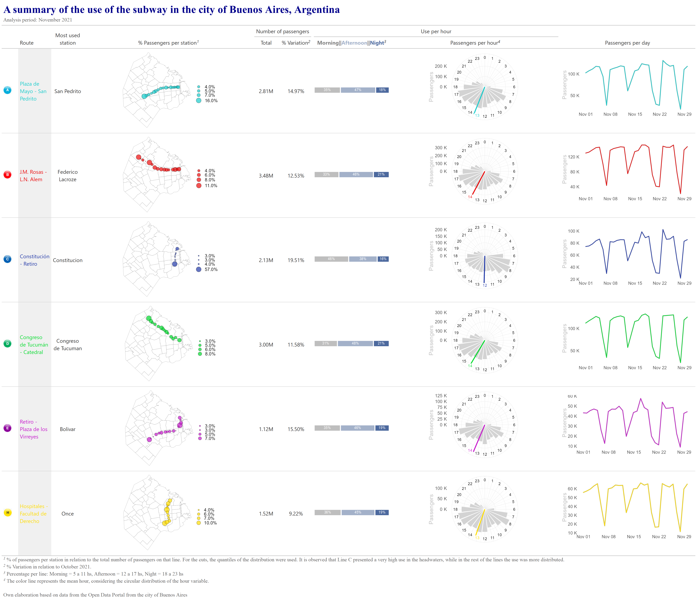
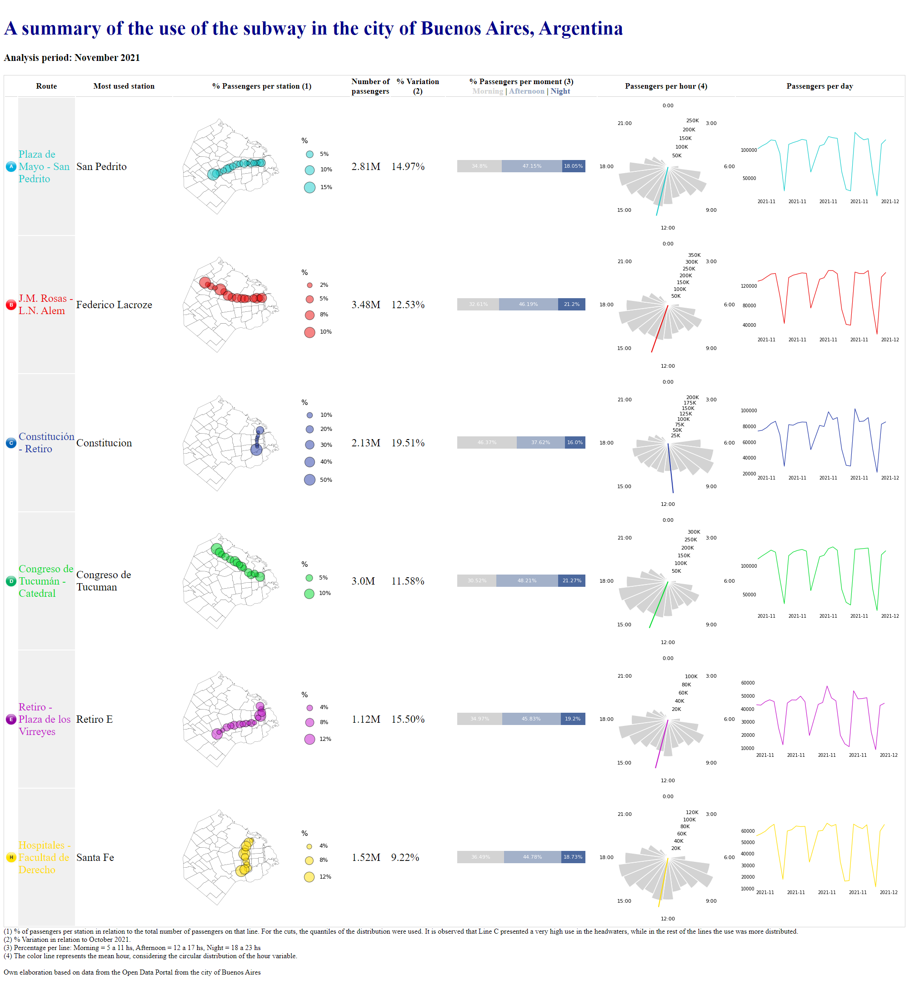

```{r setup, include=FALSE}
knitr::opts_chunk$set(
  echo = TRUE,
  eval = TRUE,
  warning = FALSE,
  message = FALSE,
  code_fold = TRUE,
  align = 'center'
)

options(scipen = 999)
```

# Introduction

The **{ggplot2} 📦**[^1]is one of the most widely used packages for data visualization in R. It is based on **Grammar of Graphics**, Wilkinson (2012), and allows you to generate plots using layers. On the other hand, the **Grammar of Tables {gt}**📦 [^2] is used to generate tables with a structure similar to that of {ggplot2}, using layers. Both approaches can be combined with tables that include graphics. In this case, I put together an example with data provided by the open data portal of the Autonomous City of Buenos Aires. The example is replicated with **{pandas}**📦[^3].

[^1]: @ggplot2

[^2]: @gt

[^3]: @mckinney2010data

This post is a short version of the following posts:

-   **gt**: [Uso del subte en la Ciudad Autónoma de Buenos Aires](https://karbartolome-blog.netlify.app/posts/tablas-subte/)

-   **pandas**: [Formato en tablas Pandas](https://karbartolome-blog.netlify.app/posts/tablas-pandas/)

The code below shows how to generate the following **tables**:

::: panel-tabset

## Comparisson

```{r}
#| echo: false
#| layout: [[50,10,40]]
#| fig-subcap: 
#|   - "Gt table (R)"
#|   - ""
#|   - "Pandas table (python)"
#| fig-align: 'center'
knitr::include_graphics(c(
  "gt_table.png",
  "https://www.i2symbol.com/images/symbols/math/almost_equal_to_u2248_icon_256x256.png",
  "pd_table.png"
))
``` 


## R table

```{r}
#| echo: false

```

## Python table

```{r}
#| echo: false

```

## Comparisson part 2

```{r}
#| echo: false
#| fig-align: 'center'
knitr::include_graphics(
  'https://media.tenor.com/tabuI4OfQHsAAAAC/the-office-pam-beesly.gif'
)
```

:::

# 1️⃣ Packages

The **required packages** 📦are loaded. Both in R and in python.

::: panel-tabset
## R

```{r}
#| code-fold: true
library(tidyverse) 
library(lubridate)  
library(circular) 
library(gt) 
library(gtExtras) 
library(gtsummary) 
library(reshape) 
library(sf) 
library(stringr)
library(circular)
library(webshot2)
library(reticulate)
conflicted::conflict_prefer("filter", "dplyr")
conflicted::conflict_prefer("webshot", "webshot2")
conflicted::conflict_prefer("select", "dplyr")
options(scipen=999)
```

## Python

A **conda environment** is created for this project, with python 3.9.5:

```{r conda_create, eval=FALSE}
#| code-fold: true
#| eval: false
reticulate::conda_create(envname='tables', python_version="3.9.5")
```

The required **python packages** 📦 are installed via conda-forge with **reticulate**:

```{r conda_install}
#| code-fold: true
#| eval: false
reticulate::conda_install(envname='tables', 
                          packages='numpy', channel = 'conda-forge')

reticulate::conda_install(envname='tables', 
                          packages='pandas', channel = 'conda-forge')

reticulate::conda_install(envname = 'tables', 
                          packages='matplotlib=3.5.3', channel='conda-forge')

reticulate::conda_install(envname = 'tables', 
                          packages='plotnine', channel='conda-forge')

reticulate::conda_install(envname = 'tables', 
                          packages='jinja2', channel='conda-forge')

reticulate::conda_install(envname = 'tables', 
                          packages='seaborn', channel='conda-forge')

reticulate::conda_install(envname = 'tables', 
                          packages='geopandas', channel='conda-forge')

reticulate::conda_install(envname = 'tables', 
                          packages='ipykernel', channel='conda-forge')
```

The conda environment is defined for this script:

```{r use_condaenv}
#| code-fold: true
reticulate::use_condaenv(
  condaenv = 'tables', 
  required = TRUE
)
```

Imports:

```{python import_py}
#| code-fold: true
import numpy as np
import pandas as pd
import geopandas as gpd
from io import BytesIO
import base64
from IPython.core.display import HTML
from plotnine import *
import seaborn as sns
import matplotlib.pyplot as plt
from mizani.formatters import date_format
from mizani.breaks import date_breaks
from scipy.stats import circmean
import pprint
import warnings
warnings.filterwarnings("ignore")
```
:::

# 2️⃣ Data

Data from **subway trips in Buenos Aires, Argentina**, is used. The period of November 2021 was considered, taking the period of October 2021 to show the percentage variation. The data is loaded with python. Through the **{reticulate} package** 📦 it will be used with R.

```{python data_url}
#| code-fold: true
#| eval: false
base_url = 'https://cdn.buenosaires.gob.ar/datosabiertos/datasets'
dataset  = 'sbase/subte-viajes-molinetes'

colors = {
  'A':'#18cccc',
  'B':'#eb0909',
  'C':'#233aa8',
  'D':'#02db2e',
  'E':'#c618cc',
  'H':'#ffdd00'
}

def read_data(url, dataset, file):
  
  path = f'{url}/{dataset}/{file}'
  
  df_ = (pd.read_csv(path, delimiter=';')
  
    # Remove useless data
    .query('~FECHA.isna()', engine='python')

    # Columns rename
    .rename(str.lower, axis='columns')
    .rename({
      'linea':'line', 
      'desde':'hour',
      'fecha':'date',
      'estacion':'station'
    },axis=1)
    
    # Transformations
    .assign(
      line = lambda x: [i.replace('Linea','') for i in x['line']],
      date = lambda x: pd.to_datetime(x['date'],format='%d/%m/%Y'),
      color = lambda x: x['line'].replace(colors)
    )
    # Selected columns
    [['line', 'color', 'date', 'hour', 'station', 'pax_total']]
  )

  return(df_)

df = read_data(url=base_url, dataset=dataset, file='molinetes_112021.csv')
df_oct = read_data(url=base_url,dataset=dataset, file='molinetes_102021.csv')
```

```{python}
#| eval: false
#| echo: false
df.to_csv('data/df_nov.csv', index=False)
df_oct.to_csv('data/df_oct.csv', index=False)
```

```{python data}
#| echo: false
df = (pd.read_csv('data/df_nov.csv')
  .assign(
    date = lambda x: pd.to_datetime(x['date']),
    hour = lambda x: pd.to_datetime(x['hour'], format='%H:%M:%S').dt.hour
  )
)

df_oct = (pd.read_csv('data/df_oct.csv')
  .assign(
    date = lambda x: pd.to_datetime(x['date']),
    hour = lambda x: pd.to_datetime(x['hour'], format='%H:%M:%S').dt.hour
  )
)
```

Some stations information is also loaded:

```{python data_stations}
#| code-fold: true
df_stations = (pd.read_csv('data/stations.csv')
  .rename({'linea':'line', 'estacion':'station'}, axis=1)
)
```

Number of passengers per station:

```{python}
#| code-fold: true
rename_stations = {
      'Flores': 'San Jose De Flores',
      'Saenz Peña ': 'Saenz Peña',
      'Callao.b': 'Callao',
      'Retiro E': 'Retiro',
      'Independencia.h': 'Independencia',
      'Pueyrredon.d': 'Pueyrredon',
      'General Belgrano':'Belgrano',
      'Rosas': 'Juan Manuel De Rosas',
      'Patricios': 'Parque Patricios',
      'Mariano Moreno': 'Moreno'
}

df_passengers_station = (df
  .groupby(['line','color','station'], as_index=False)
  .agg(pax_total = ('pax_total','sum'))
  .assign(station = lambda x: x['station'].str.title())
  .replace(rename_stations)
  .merge(df_stations, on=['line','station'])
)
```

**Spatial data**

Geojson data from the city of Buenos Aires is loaded, in this case, both in R and python:

::: panel-tabset
### R

```{r}
#| code-fold: true
base_url = 'http://cdn.buenosaires.gob.ar/datosabiertos/datasets/barrios/'
url = paste0(base_url, 'barrios.geojson')

map_caba <- st_read(url, quiet = TRUE) %>% 
  mutate(barrio=str_to_title(BARRIO))
```

### Python

```{python}
#| code-fold: true
map_caba = gpd.read_file(r.url)
```
:::

# 3️⃣Table

## Style and parameters definitions

Some aspects are defined in python:

```{python params}
#| code-fold: true
custom_style = [
  {'selector':"caption",
   'props':[("text-align", "left"),
            ("font-size", "135%"),
            ("font-weight", "bold")]},
  {'selector':'th', 
   "props":  'text-align : center; background-color: white; color: black; font-size: 18; border-bottom: 1pt solid lightgrey'},
  {"selector": "", 
   "props": [("border", "1px solid lightgrey")]}
]

title ='A summary of the use of the subway in the city of Buenos Aires, Argentina'
subtitle = 'Analysis period: November 2021'

source = "<br>Own elaboration based on data from the Open Data Portal from the city of Buenos Aires</br>"

footer_map = "% of passengers per station in relation to the total number of passengers on that line. For the cuts, the quantiles of the distribution were used. It is observed that Line C presented a very high use in the headwaters, while in the rest of the lines the use was more distributed."
               
footer_variation = "% Variation in relation to October 2021."

footer_clock = "The color line represents the mean hour, considering the circular distribution of the hour variable."

footer_moments_day = "Percentage per line: Morning = 5 a 11 hs, Afternoon = 12 a 17 hs, Night = 18 a 23 hs"
```

## Functions definition

### Images

A function to map a .jpg image with a column of a dataframe:

```{python function_map_img}
#| code-fold: true
def map_line_img(i):
    path = f'images/{i.lower()}.jpg'
    return ''
```

### Line plot

The evolution of passengers per day is included in the tables based on a line plot. Here, some functions are defined to generate these plots. 

::: panel-tabset
#### R

```{r}
#| code-fold: true
fig_evol_pax_total <- function(.line, .color){
  py$df %>% 
    filter(line == .line) %>%
    group_by(date) %>%
    summarise(n = sum(pax_total)) %>%
    ggplot(aes(x = date, y = n)) +
    geom_line(color = 'grey', size = 2.5) +
    geom_line(color = .color, size = 1.5) +
    scale_y_continuous(
      labels = scales::unit_format(unit = "K", scale = 1e-3)
    ) +
    labs(x = '', y = 'Passengers') +
    theme_minimal() +
    theme(
      text = element_text(size = 30),
      axis.title.y = element_text(color = 'grey'),
      panel.grid = element_blank()
    )
}
```

#### Python

```{python function_map_evol}
#| code-fold: true
def fig_evol_pax_total(i):
  
    data_line=df.query("line==@i")

    color = data_line.color.max()

    data_line=(data_line
      .groupby('date', as_index=False)
      .pax_total
      .sum()
    )
    
    p = (ggplot(
          data = data_line, 
          mapping = aes(x='date', y='pax_total',group=1)
        ) + 
        geom_line(color=color)+
        theme_minimal()+
        labs(x='',y='N')+
        scale_x_datetime(
          labels = date_format("%Y-%m"), 
          breaks=date_breaks('7 days')
        )+
        labs(x = '', y = '') +
        theme_void()+
        theme(
          panel_background= element_rect(fill=None),
          plot_background = element_rect(fill=None),
          text=element_text(size=7), 
          axis_text_x=element_text(vjust=-0.5)
        )
    )
    return p
  
def plotnine2html(p,i, width=4, height=2):
  
    figfile = BytesIO()
    p.save(figfile, format='png', width=width, height=height, units='in')
    figfile.seek(0) 
    figdata_png = base64.b64encode(figfile.getvalue()).decode()
    imgstr = f''
    
    return imgstr
  
def map_plot_evol(i):
    fig = fig_evol_pax_total(i)
    return plotnine2html(fig,i)
```
:::

### Map

Some functions are defined in order to generate the maps in the tables.

::: panel-tabset
#### R

```{r}
#| code-fold: true
fig_map <- function(.df, .line){
   temp <- .df %>% 
    filter(line==.line) %>% 
    mutate(pax_percent = pax_total / sum(pax_total))
   
  lbreaks <- round(quantile(temp$pax_percent, c(0,0.25,0.5,0.75,1)),2) %>%
    as.numeric()
  
  ggplot() +
    geom_sf(data = map_caba, 
            color = "black", 
            fill = 'white',
            size = 0.1, 
            show.legend = FALSE)+
    geom_point(data = temp,
               aes(x = long, y = lat, size=pax_percent), alpha=0.7,
               fill = temp$color %>% unique(), color='black', shape=21)+
    scale_size_continuous(breaks = lbreaks, range=c(1,10),
                          limits=c(min(temp$pax_percent),max(temp$pax_percent)),
                          labels = scales::percent(lbreaks, accuracy=0.1))+
    theme_void()+
    theme(text = element_text(size = 25), 
          legend.position = 'right', 
          axis.text = element_blank(), 
          plot.margin = unit(c(0, 0, 0, 0), "null"))+
    labs(x='',y='',size='')
}
```

#### Python

```{python, function_map_map}
#| code-fold: true
def fig_map(i):

    total_passengers=(df_passengers_station
      .loc[df_passengers_station['line']==i]
      ['pax_total']
      .sum()
    )
    
    data_line=(df_passengers_station
      .loc[df_passengers_station['line']==i]
      .assign(
        pax_percent = lambda x: 
          (x['pax_total']/total_passengers)*100
      )
    )
    
    color = data_line.color.max()
    
    lbreaks = round(
      data_line['pax_percent'].quantile([0,0.25,0.5,0.75,1]),2
    )

    p = (ggplot(data=map_caba)+
        geom_map(fill='white', color = "black", size = 0.1)+
        geom_point(data=data_line, 
            mapping=aes(x='long',y='lat', size='pax_percent'),
            alpha=0.5, color='black', shape='o', fill=color)+
        scale_size_continuous(
          lbreaks=lbreaks, 
          range=[1,10],
          limits = [
            data_line['pax_percent'].min()-1,
            data_line['pax_percent'].max()+1
          ],
          labels=lambda l: [f'{round(i)}%' for i in l])+
        theme_void()+
        theme(legend_position='right')+
        labs(size='%')
    )

    return p

def map_plot_mapa(i):
  fig = fig_map(i=i)
  return plotnine2html(fig, i, width=3, height=3)
```
:::

### Bar plot

In {gt} a function will be used to generate the percentage per moment of the day plot. In python, however, a function needs to be defined:

```{python map_bar_plot}
#| code-fold: true
def fig_percent(i):
    temp = (df
        .query('line==@i')
        .assign(
            group_hour = lambda x: pd.cut(
                x['hour'], bins=3, labels = ['Morning', 'Afternoon', 'Night'])
        )
        .groupby(['line','group_hour'], as_index=False)
        .agg(pax_total = ('pax_total','sum'))    
    )
    temp['perc']=round(
      temp['pax_total'] / temp.groupby('line')['pax_total'].transform('sum')*100,2)
    temp['perc_lab'] = [str(i)+'%' for i in temp['perc']]

    p=(ggplot(data=temp, 
            mapping=aes(x='line', y='perc', fill='group_hour', label='perc_lab'))+
        geom_col(position= position_stack(reverse=True))+
        geom_text(
            position = position_stack(vjust = .5, reverse=True), 
            color='white', size=8)+
        coord_flip()+
        scale_fill_manual(['lightgrey', '#A3B1C9','#4C699E'])+
        theme_void()+
        theme(legend_position='none')
    )
    return p
    
def map_plot_percent(i):
    fig = fig_percent(i)
    return plotnine2html(fig,i, width=4, height=0.4)
```

### Circular plot

For the circular plot, both functions are defined in R and python. 

::: panel-tabset
#### R

The mean hour is generated in R, with the **{circular}** package:

```{r}
#| code-fold: true
get_hour <- function(.line, .df) {
  temp <- .df %>%
    filter(line == .line) %>%
    select(hour, pax_total)
  
    hour <- untable(temp, num = temp$pax_total) %>%
      select(-pax_total) %>%
      mutate(circular_hour = circular(hour, 
                                      template = "clock24", 
                                      units = "hours")) %>%
      summarise(hour = mean(circular_hour)) %>%
      pull(hour)
  
  as.numeric(hour) %% 24
}
```

```{r mean_hour}
#| eval: false
#| code-fold: true
df_mean_hours <- data.frame(
    line=py$df %>% pull(line) %>% unique()
  ) %>% 
  mutate(mean_hour = map(line, ~get_hour(.line=.x, .df=py$df))) %>% 
  mutate(mean_hour = unlist(mean_hour))
```

```{python}
#| eval: false
#| echo: false
r.df_mean_hours.to_csv('data/df_mean_hours.csv', index=False)
```

```{r mean_hour_load}
#| echo: false
df_mean_hours = read_csv('data/df_mean_hours.csv')
```

```{r}
#| code-fold: true
fig_clock_plot <- function(.line, .df, .color = 'black') {
  
  mean_hour = df_mean_hours %>% filter(line==.line) %>% pull(mean_hour)
  
  temp <- data.frame(hour = seq(0, 23)) %>%
    left_join(
      .df %>%
        filter(line == .line) %>%
        group_by(hour) %>%
        summarise(pax_total = sum(pax_total)) %>%
        ungroup()
    ) %>%
    mutate(color_hour = ifelse(hour == round(mean_hour), TRUE, FALSE)) %>%
    mutate(pax_total = ifelse(is.na(pax_total), 0, pax_total))
  
  temp %>%
    ggplot(aes(x = hour, y = pax_total)) +
    geom_col(color = 'white', fill = 'lightgrey') +
    coord_polar(start = 0) +
    geom_vline(xintercept = mean_hour,
               color = .color,
               size = 2) +
    geom_label(
      aes(
        x = hour,
        y = max(pax_total) + quantile(pax_total, 0.3),
        color = color_hour,
        label = hour
      ),
      size = 6,
      label.size = NA,
      show.legend = FALSE
    ) +
    scale_color_manual(values = c('black', .color)) +
    scale_x_continuous(
      "",
      limits = c(0, 24),
      breaks = seq(0, 24),
      labels = seq(0, 24)
    ) +
    scale_y_continuous(labels = scales::unit_format(unit = "K", scale = 1e-3)) +
    labs(y = 'Passengers') +
    theme_minimal() +
    theme(text = element_text(size = 25, color = 'grey'),
          axis.text.x = element_blank())
}
```

#### Python

```{python map_circular_plot}
#| code-fold: true

from matplotlib.ticker import FuncFormatter

def thousand_format(x, pos):
    return f'{round(x / 1000)}K'
  
  
def gen_clock_plot(df_, mean_hour, x='hour', y='pax_total', color='blue'):
  
    plt.rc('font', size=8)  
    plt.axis('off')

    fig, ax = plt.subplots(figsize=(3,3))
    ax = plt.subplot(111, polar=True)

    cr = df_[y].astype('float').to_numpy()
    hour = df_[x].astype('float').to_numpy()
    
    N = 24
    bottom = 2
    theta = np.linspace(0.0, 2 * np.pi, N, endpoint=False)
    width = (2*np.pi) / N
    
    bars = ax.bar(theta, cr,
      width=width, 
      bottom=bottom, 
      color='lightgrey', 
      edgecolor='white')
      
    ax.vlines(
      x= mean_hour*theta.max()/24, 
      ymin=0, ymax=df_['pax_total'].max(), 
      color=color)
      
    ax.set_theta_zero_location("N")
    ax.set_theta_direction(-1)
    ticks = ['0:00', '3:00', '6:00', '9:00', '12:00', '15:00', '18:00', '21:00']
    ax.set_xticklabels(ticks)
    ax.yaxis.set_major_formatter(FuncFormatter(thousand_format))
    ax.grid(False)
    for key, spine in ax.spines.items():
      spine.set_visible(False)


    return fig

def fig_clock_plot(i):
    data_line=df.query("line==@i")
    color = data_line.color.max()

    data_hour = (pd.DataFrame({'hour':range(0,24)})
        .merge(df
            .query('line==@i')
            .groupby('hour', as_index=False)
            .agg(pax_total = ('pax_total','sum')),
            how='left'
        )
        .fillna(0)
    )
    mean_hour = r.df_mean_hours.query("line==@i").mean_hour

    return gen_clock_plot(data_hour, color=color, mean_hour=mean_hour)
  
def clock2inlinehtml(p,i):
    figfile = BytesIO()
    plt.savefig(figfile, format='png', dpi=100, transparent=True)
    figfile.seek(0) 
    figdata_png = base64.b64encode(figfile.getvalue()).decode()
    imgstr = f''
    figfile.close()
    return imgstr

def map_plot_clock(i):
    plt.figure(figsize=(2,2))
    fig = fig_clock_plot(i)
    return clock2inlinehtml(fig,i)
```
:::

## Data definition

First, an R and pandas dataframe is generated. This dataframe will later be styled into a well formated table.

::: panel-tabset
#### R

```{r}
#| code-fold: true
cols_selected = c('line','Route','most_used_station','Map','pax_total',
 'variation', 'passengers_type', 'clock_plot','passengers_per_day','color')


r_table_data <- py$df %>% select(line, color) %>% unique() %>% 
  
  arrange(line) %>% 
  
  # Routes
  mutate(
    Route = case_when(
      line == 'A' ~ 'Plaza de Mayo - San Pedrito',
      line == 'B' ~ 'J.M. Rosas - L.N. Alem',
      line == 'C' ~ 'Constitución - Retiro',
      line == 'D' ~ 'Congreso de Tucumán - Catedral',
      line == 'E' ~ 'Retiro - Plaza de los Virreyes',
      line == 'H' ~ 'Hospitales - Facultad de Derecho',
      TRUE ~ ''
    )
  ) %>%
  
  left_join(
    py$df %>%
      mutate(group_hour = cut(
        hour,
        breaks = 3,
        labels = c('Morning', 'Afternoon', 'Night')
      )) %>%
      group_by(line, group_hour) %>%
      summarise(pax_total = sum(pax_total)) %>%
      group_by(line) %>%
      mutate(pax_percent = round(pax_total / sum(pax_total) * 100)) %>%
      group_by(line) %>%
      summarise(passengers_type = list(pax_percent))
  ) %>%
  
  left_join(py$df %>%
              group_by(line) %>%
              summarise(pax_total = sum(pax_total))) %>%
  
  left_join(py$df_oct %>%
              group_by(line) %>%
              summarise(pax_total_oct = sum(pax_total))) %>%
  
  mutate(variation = (pax_total / pax_total_oct - 1)) %>%
  
  left_join(
    py$df %>%
      group_by(line, most_used_station = station) %>%
      summarise(pax_total = sum(pax_total)) %>%
      group_by(line) %>%
      slice(which.max(pax_total)) %>% select(-pax_total)
  ) %>%
  
  # Applying functions
  mutate(

    clock_plot = map2(line, color,
      ~ fig_clock_plot(.line = .x, .df = py$df, .color = .y)
      ),
    
    passengers_per_day = map2(line, color,
      ~ fig_evol_pax_total(.line=.x, .color=.y)
      ),
    
    Map = map(line, ~ fig_map(.df = py$df_passengers_station, .line = .x)
      )
  ) %>% 
  
  # Columns selected in order:
  select(all_of(cols_selected))
```

#### Python

```{python}
#| code-fold: true
paths = {
  'A':'Plaza de Mayo - San Pedrito',
  'B':'J.M. Rosas - L.N. Alem',
  'C':'Constitución - Retiro',
  'D':'Congreso de Tucumán - Catedral',
  'E':'Retiro - Plaza de los Virreyes',
  'H':'Hospitales - Facultad de Derecho'
}

py_table_data = (df 

    .groupby(['line','color'], as_index=False)
    
    .agg(
        most_used_station = ('station', pd.Series.mode),
        pax_total = ('pax_total','sum')
    )
        
    .merge(df_oct
          .groupby('line', as_index=False)
          .agg(pax_total_oct = ('pax_total','sum')), 
        on='line', how='left')
        
    .assign(
       variation = lambda x: (x['pax_total']/x['pax_total_oct']-1),
       pax_total = lambda x: [str(round(i/1000000,2))+'M' for i in x['pax_total']],
       Route = lambda x: x['line'].replace(paths),
       passengers_per_day = lambda x: x['line'],
       Map = lambda x: x['line'],
       clock_plot = lambda x: x['line'],
       passengers_type = lambda x: x['line']
    )

    [r.cols_selected]
)

color_mapping = dict(zip(py_table_data['Route'], py_table_data['color']))
color_mapping_back = dict(zip(py_table_data['Route'], ['#f0f0f0']*6))
```
:::

## Table

::: panel-tabset
### R

```{r}
#| code-fold: true
gt_table <- r_table_data %>%
  
  gt() %>% 
  
  tab_header(
    title = md(paste0('**',py$title,'**')),
    subtitle = py$subtitle
  ) %>%
  
  # Estilo
  tab_style(locations = cells_title(groups = 'title'),
    style = list(
      cell_text(
        font = google_font(name = 'Raleway'),
        size = 'xx-large', weight = 'bold', align = 'left', color  = 'darkblue'
      )
    )) %>% 
      
  tab_style(locations = cells_title(groups = 'subtitle'),
  style = list(
    cell_text(
      font  = google_font(name = 'Raleway'),
      size  = 'medium', align = 'left', color = '#666666'
    )
  )) %>% 
  
  opt_align_table_header('left') %>%
  cols_align('center',
    columns = c(
      'pax_total','variation','most_used_station',
      'clock_plot', 'passengers_per_day')
  ) %>%

  cols_width(
    line ~ px(50),
    Route ~ px(100),
    most_used_station ~ px(80),
    clock_plot ~ px(20),
    pax_total ~ px(80),
    variation ~ px(100)
  ) %>%  
  
  # Grouping columns
  tab_spanner(label = "Use per hour",
              columns = c(passengers_type, clock_plot)) %>%

  tab_spanner(label= "Number of passengers",
              columns = c(pax_total, variation)) %>%
  
   # Colors
  tab_style(
    style = cell_text(color = "#18cccc"),
    locations = cells_body(columns = c(Route), rows = line == 'A')
  ) %>%
  tab_style(
    style = cell_text(color = "#eb0909"),
    locations = cells_body(columns = c(Route), rows = line == 'B')
  ) %>%
  tab_style(
    style = cell_text(color = "#233aa8"),
    locations = cells_body(columns = c(Route), rows = line == 'C')
  ) %>%
  tab_style(
    style = cell_text(color = "#02db2e"),
    locations = cells_body(columns = c(Route), rows = line == 'D')
  ) %>%
  tab_style(
    style = cell_text(color = "#c618cc"),
    locations = cells_body(columns = c(Route), rows = line == 'E')
  ) %>%
  tab_style(
    style = cell_text(color = "#ffdd00"),
    locations = cells_body(columns = c(Route), rows = line == 'H')
  ) %>%
  tab_style(style     = list(cell_fill(color = "#f0f0f0")),
            locations = cells_body(columns = c('Route'))) %>% 
  
   # Format numeric columns
  fmt_number(pax_total, suffixing = TRUE) %>% 
  fmt_percent(variation) %>% 
  
  # Mappings:
  text_transform(
    locations = cells_body(columns = c(line)),
    fn = function(line) {
      lapply(here::here('', paste0('images/', tolower(line), '.jpg')),
             local_image, height = 25)
    }
  ) %>%
  cols_label(line = '') %>% 
  
  gt_plt_bar_stack(
    column = passengers_type,
    position = 'fill',
    labels = c("Morning","Afternoon","Night"),
    palette = c('grey', '#A3B1C9','#4C699E'),
    fmt_fn = scales::label_percent(scale=1),
    width = 60) %>% 
  
  text_transform(
    locations = cells_body(columns = clock_plot),
    fn = function(x) {
      map(r_table_data$clock_plot,
        gt::ggplot_image,
        height = px(250),
        aspect_ratio = 2)
    }
  ) %>%
  
  text_transform(
    locations = cells_body(columns = passengers_per_day),
    fn = function(x) {
      map(r_table_data$passengers_per_day,
        gt::ggplot_image,
        height = px(200),
        aspect_ratio = 2)
    }
  ) %>%
  
  text_transform(
    locations = cells_body(columns = Map),
    fn = function(x) {
      map(r_table_data$Map,
        gt::ggplot_image,
        height = px(250),
        aspect_ratio = 2)
    }
  ) %>% 

  # Naming variables
  cols_label(
    Map = md('% Passengers per station'),
    clock_plot = md('Passengers per hour'),
    pax_total = md('Total'),
    variation = md('% Variation'),
    passengers_per_day = md('Passengers per day'),
    most_used_station = md('Most used station')
  ) %>% 
  
  
  tab_footnote(cells_column_labels(columns = variation), 
               footnote = py$footer_variation) %>%
  
  tab_footnote(cells_column_labels(columns = clock_plot), 
               footnote = py$footer_clock) %>%
  
  tab_footnote(cells_column_labels(columns = Map), 
               footnote = py$footer_map) %>%
  
  tab_footnote(cells_column_labels(columns = passengers_type), 
               footnote = py$footer_moments_day) %>%
  
  tab_source_note(
    source_note = html(py$source)
  ) %>% 
  
  
  tab_style(locations = cells_source_notes(),
            style = list(cell_text(
              font  = google_font(name = 'Raleway'),
              size  = 'medium', align = 'left',  color = '#666666'
            ))) %>%
  
  tab_style(locations = cells_footnotes(),
            style   = list(cell_text(
              font  = google_font(name = 'Raleway'),
              size  = 'medium', align = 'left',  color = '#666666'
            ))) %>% 

  tab_options(
    data_row.padding = px(0),
    table.border.top.style = "hidden",
    table.border.bottom.style = "hidden",
    table_body.border.top.style = "solid",
    column_labels.border.bottom.style = "solid"
  ) %>% 
  
  cols_hide('color')
  
gt_table
```

### Python

```{python}
#| column: page
#| code-fold: true
pd_table = (py_table_data.drop('color',axis=1)
  
  .style
  
  .applymap(lambda v: f"color: {color_mapping.get(v, 'black')}")
  
  .applymap(lambda v: f"background-color: {color_mapping_back.get(v, 'white')}")
  
  .set_table_styles(custom_style)
  
  .set_caption(f"""
    <h1><span style="color: darkblue">{title}</span><br></h1>
    <span style="color: black">{subtitle}</span><br><br> 
    """
   )
   
  .hide(axis='index')
  
  # Mappings:
  .format(
    formatter={
      'line':map_line_img,
      'Map':map_plot_mapa,
      'passengers_per_day': map_plot_evol, 
      'passengers_type':map_plot_percent,
      'clock_plot': map_plot_clock,
      'variation': '{:,.2%}'.format
    }
  )
  
  .set_properties(**{'font-size': '18pt'}, overwrite=False)
  .set_properties(subset=['Route'], **{'width': '10px'}, overwrite=False)
  .set_properties(subset=['line'], **{'width': '5px'}, overwrite=False)
  
  .to_html()
  
  .replace('line</th>','')
  .replace('pax_total</th>','Number of<br>passengers')
  .replace('passengers_type</th>',
   """% Passengers per moment (3)<br>
      <span style="color: lightgrey">Morning</span> |
      <span style="color: #A3B1C9">Afternoon</span> |
      <span style="color: #4C699E">Night</span>
   """
  )
  .replace('Map</th>','% Passengers per station (1)')
  .replace('variation</th>','% Variation (2)')
  .replace('passengers_per_day</th>','Passengers per day')
  .replace('clock_plot</th>','Passengers per hour (4)')
  .replace('most_used_station</th>','Most used station')
   + f"""<caption>
            (1) {footer_map}
            <br>(2) {footer_variation}
            <br>(3) {footer_moments_day}
            <br>(4) {footer_clock}
            <br>{source}
         </caption>"""
)

# Displaying the table
HTML(pd_table)
```
:::

# Saving the table

Both tables are saved as a png image.

::: panel-tabset
#### R

```{r}
#| code-fold: true
#| eval: true
gt::gtsave(gt_table, 'gt_table.png', vwidth = 2400, vheight = 1000)
# gt::gtsave(data=gt_table, filename='gt_table.html')
# webshot(
#   url='gt_table.html', 
#   file="gt_table2.png",
#    vwidth = 2000, vheight = 1500, cliprect = "viewport"
# )
```

#### python

```{python}
#| code-fold: true
#| eval: true
f = open("pd_table.html", "w")
f.write(pd_table)
f.close()
```

In this case, I've decided to use **{webshot2}**, an R package to convert an html file to png:

```{r}
#| code-fold: true
#| eval: true
webshot2::webshot(
  url='pd_table.html', 
  file="pd_table.png",
  vwidth=2000,
  vheight = 2200,
  cliprect = "viewport"
)
```
:::


## Contact ✉

Karina Bartolome, [Linkedin](https://www.linkedin.com/in/karinabartolome/), [Twitter](https://twitter.com/karbartolome), [Github](https://github.com/karbartolome), [Blogpost](https://karbartolome-blog.netlify.app/)


